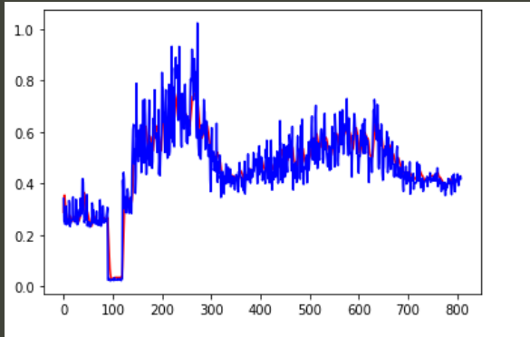
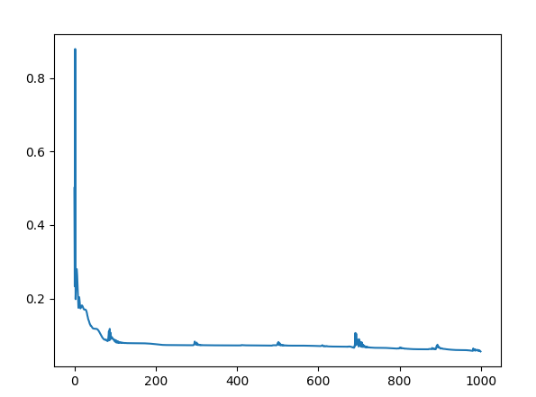

# DSAI_HW1
## 操作環境
* windows10, python3.6.12, pytorch1.6
## 使用說明
* 可用參數
   - --training [filepath/filename.csv] 用於輸入資料檔案名稱
   - --encoding [big5] 用於輸入資料編碼 ex: big5, utf-8
   - --output [filepath/submission.csv] 用於輸出檔案名稱
* 簡易使用
   - python main.py
## 個人說明
* 因政府公開資料有編碼差異，因此在parameter中有多增加一個encoding的部分。
* 若直接執行，將會有training 階段， epoch 為1000 ，若無GPU**慎用**亦或自行更改epoch。

* 用最蠢的方式進行預測，每預測下一天，將該預測與前筆資料結合後再預測下一天，輸出日期將會是輸入資料最新的一天向後8天的預測結果，如果不知如何操作就整包下載直接使用python main.py即可。

* Code 修改自 https://wizardforcel.gitbooks.io/learn-dl-with-pytorch-liaoxingyu/content/5.3.html 僅用於作業參考用途

* 簡易資料分析與預測

>圖表中**藍色**為GT **紅色**為Predict

* 作業Training Loss

        Author : taki
        Date : 2021/3/21(日)